# Portfolio de Arte Segura - CRUD Laravel + Breeze

Sistema completo de gestión de portfolio de arte con autenticación segura, operaciones CRUD para obras y diseño moderno, construido con **Laravel 12**, **Breeze** y **Bootstrap 5**, siguiendo estrictas prácticas de seguridad y documentación.

<p align="center">
    
    
    
</p>

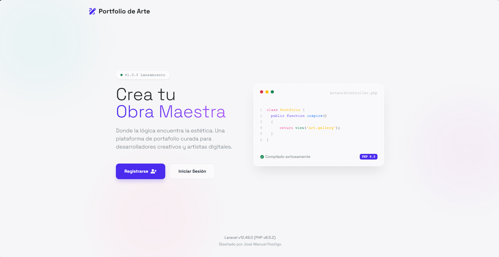

## Descripción

Esta aplicación implementa un sistema seguro para que artistas digitales gestionen y muestren sus obras. Combina un frontend atractivo y responsive con un backend robusto protegido por autenticación.

Permite a los usuarios registrados gestionar el ciclo de vida de sus **Obras** (Título, Descripción, Imagen, Técnica, Visibilidad), mientras que mantiene una sección pública y un panel de control privado.

---

## Capturas de Pantalla

### 1. Login y Autenticación (Breeze)
Sistema de login seguro con protección CSRF y validación de credenciales.
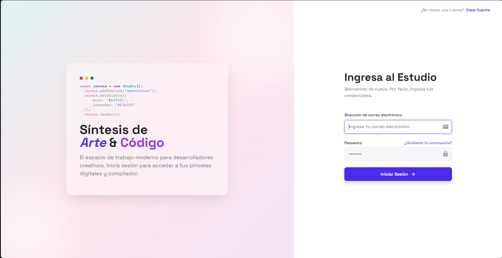

#### Registro y Recuperación
Flujos completos de registro de nuevos usuarios y recuperación de acceso.
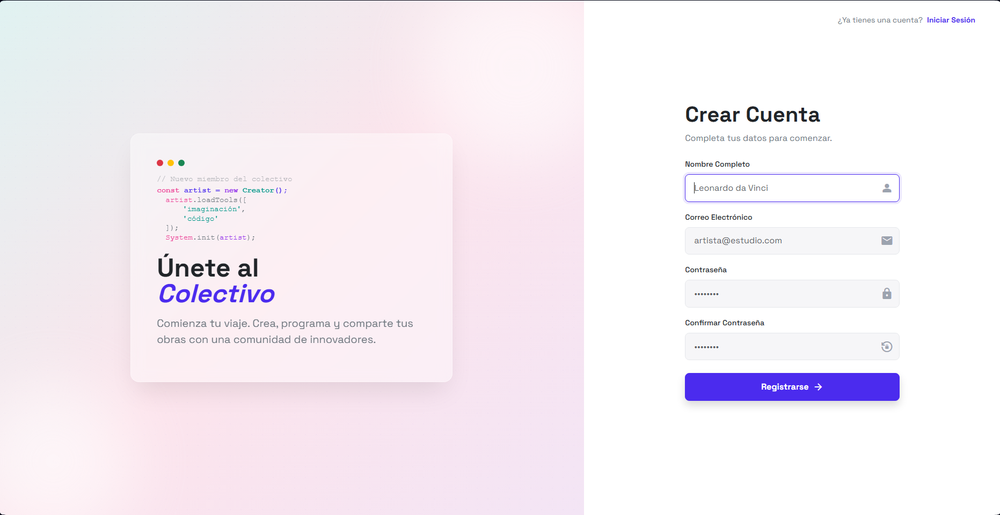
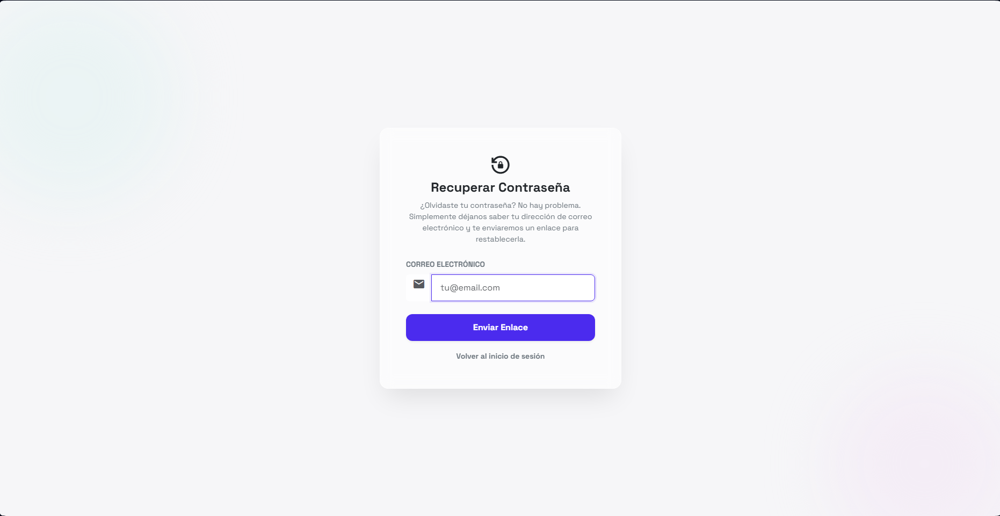

### 2. Dashboard (Estudio)
Panel de control principal para el artista, con accesos rápidos a gestión.
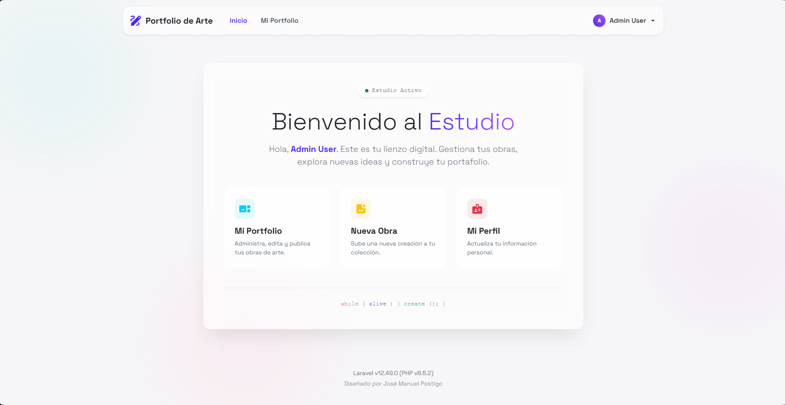

#### Perfil de Usuario
Gestión de cuenta, actualización de datos y seguridad.
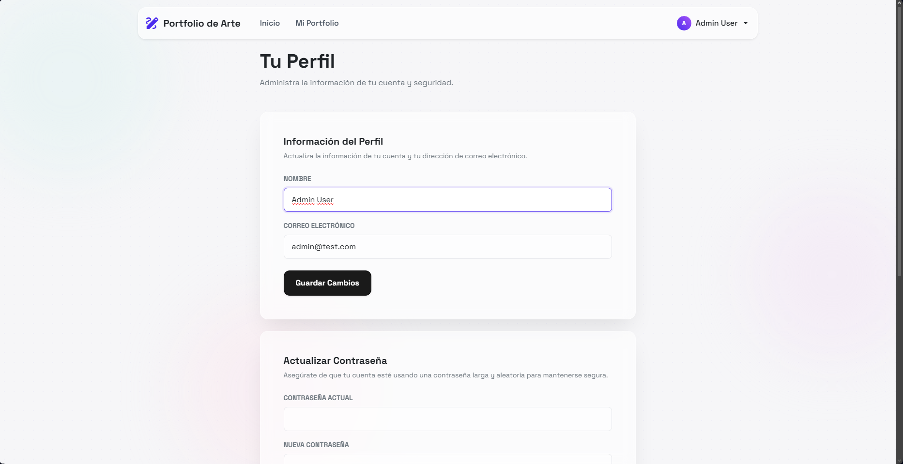

### 3. CRUD de Obras
Gestión completa de piezas artísticas con subida de imágenes y control de visibilidad.

#### A. Listado de Obras (Gallery Grid)
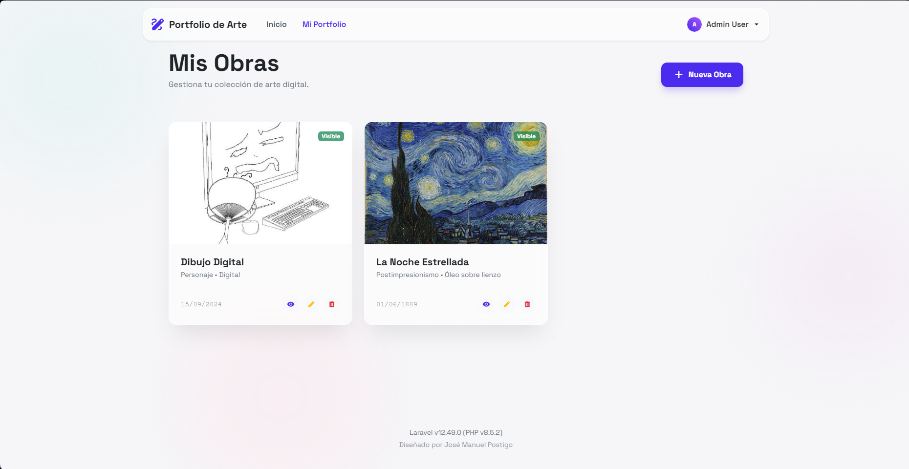

#### B. Crear Nueva Obra
Formulario con validación en tiempo real y estilos glassmorphism.
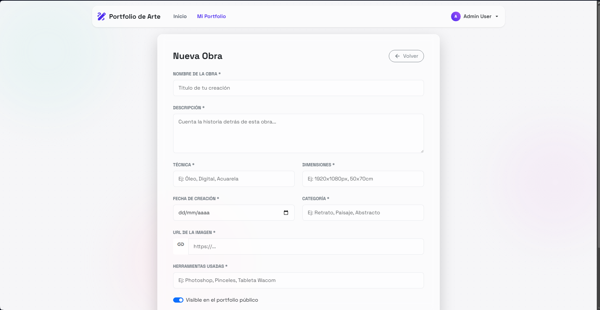

#### C. Detalle de Obra
Vista individual con ficha técnica completa.
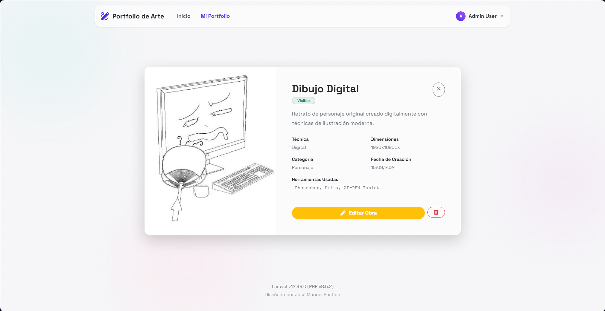

#### D. Editar Obra
Formulario para la modificación de obras existentes.
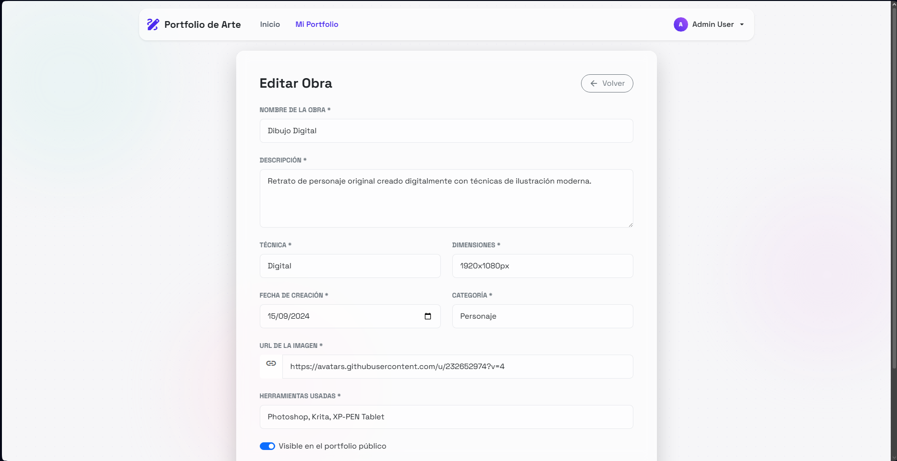

---

## Arquitectura del Proyecto

El proyecto sigue la arquitectura estándar **MVC** de Laravel, con una clara separación de responsabilidades y capas de seguridad adicionales:

```
CRUD-Breeze-PortfolioArte/
├── app/
│   ├── Http/
│   │   ├── Controllers/
│   │   │   ├── ObraController.php      # Lógica CRUD de Obras (Anotada paso a paso)
│   │   │   ├── ProfileController.php   # Gestión de perfil (Breeze)
│   │   │   └── Auth/                   # Controladores de Autenticación
│   │   ├── Requests/
│   │   │   ├── StoreObraRequest.php    # Validación estricta para Creación
│   │   │   └── UpdateObraRequest.php   # Validación estricta para Edición
│   │   └── Models/
│   │       ├── User.php                # Modelo de Usuario (Artista)
│   │       └── Obra.php                # Entidad Principal (Portafolio)
│   │
├── database/
│   ├── migrations/                     # Estructura de BD (create_obras_table)
│   └── seeders/                        # Datos de prueba (User Admin + Van Gogh)
│
├── resources/
│   └── views/
│       ├── layouts/                    # Plantillas base (app, guest, bootstrap)
│       ├── obras/                      # Vistas CRUD (index, create, edit, show)
│       ├── welcome.blade.php           # Landing Page
│       └── dashboard.blade.php         # Panel de Control
│
├── routes/
│   ├── web.php                         # Rutas protegidas y públicas
│   └── auth.php                        # Rutas de autenticación
│
└── public/
    └── imgReadme/                      # Recursos para documentación
```

### Flujo de la Aplicación

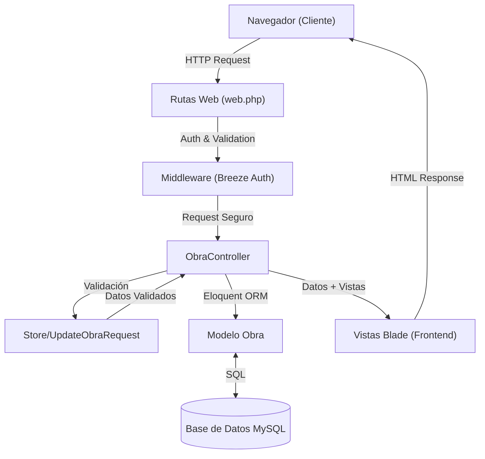

---

## Características de Seguridad Implementadas

### 1. Autenticación Robusta (Laravel Breeze)
Implementación estándar de la industria para autenticación de usuarios, gestión de sesiones, reseteo de contraseñas y verificación de email.

**Rutas:** `routes/auth.php`
> <sub>php</sub>
```php
Route::middleware('guest')->group(function () {
    Route::get('login', [AuthenticatedSessionController::class, 'create'])
        ->name('login');
    // ...
});
```

### 2. Validación de Datos (Form Requests)
Toda entrada de datos es filtrada y validada mediante clases `FormRequest` dedicadas, asegurando que solo datos válidos y sanitizados lleguen al controlador.

**Archivo:** `app/Http/Requests/StoreObraRequest.php`
> <sub>php</sub>
```php
public function rules(): array
{
    return [
        'nombre_obra' => 'required|string|max:255',
        'descripcion' => 'required|string',
        'imagen_url'  => 'required|url',
        // ...
    ];
}
```

### 3. Autorización de Recursos (Policies/Gates)
Protección lógica para asegurar que un usuario solo pueda editar o eliminar **sus propias obras**.

**Archivo:** `app/Http/Controllers/ObraController.php`
> <sub>php</sub>
```php
if ($obra->user_id !== Auth::id()) {
    abort(403, 'No Autorizado');
}
```

### 4. Protección CSRF
Todos los formularios incluyen tokens CSRF (`@csrf`) para prevenir ataques de falsificación de peticiones en sitios cruzados.

**Archivo:** `resources/views/obras/create.blade.php`
> <sub>html</sub>
```html
<form action="{{ route('obras.store') }}" method="POST">
    @csrf
    <!-- Campos del formulario -->
</form>
```

### 5. Protección contra Asignación Masiva
Los modelos tienen definida estrictamente la propiedad `$fillable` para evitar que campos sensibles sean modificados malintencionadamente.

**Archivo:** `app/Models/Obra.php`
> <sub>php</sub>
```php
protected $fillable = [
    'nombre_obra', 'descripcion', 'visible', 'user_id', ...
];
```

---

## Instalación y Despliegue

### 1. Requisitos Previos
*   PHP 8.2+
*   Composer
*   Node.js & NPM
*   Servidor MySQL/MariaDB

### 2. Pasos de Instalación
> <sub>bash</sub>
```bash
# 1. Instalar dependencias backend
composer install

# 2. Instalar dependencias frontend
npm install

# 3. Configurar entorno
cp .env.example .env
# (Configura DB_DATABASE, DB_USERNAME, etc en el archivo .env)

# 4. Generar clave de aplicación
php artisan key:generate

# 5. Compilar assets (Vite)
npm run build

# 6. Migrar BD y sembrar datos de prueba
php artisan migrate --seed
```

### 3. Credenciales de Acceso (Seeder)

El sistema viene pre-configurado con un usuario administrador y obras de ejemplo:

| Rol       | Email            | Contraseña    |
| :-------- | :--------------- | :------------ |
| **Admin** | `admin@test.com` | `password123` |

---

## Tecnologías Utilizadas

| Tecnología     | Versión | Uso                      |
| :------------- | :------ | :----------------------- |
| **Laravel**    | 12.x    | Framework Backend        |
| **Breeze**     | 2.x     | Sistema de Autenticación |
| **Blade**      | -       | Motor de Plantillas      |
| **Bootstrap**  | 5.3     | Framework CSS ui         |
| **MySQL**      | 8.x     | Base de Datos            |
| **Vite**       | 7.x     | Empaquetador de Assets   |
| **Alpine.js**  | 3.x     | Interactividad Frontend  |
| **Axios**      | 1.x     | Cliente HTTP             |
| **FakerPHP**   | 1.x     | Generación de Datos      |
| **PHP**        | 8.5     | Lenguaje del Servidor    |
| **Laragon**    | 6.x     | Entorno de Desarrollo    |
| **phpMyAdmin** | 5.x     | Gestión de Base de Datos |

---

## Referencias

- [Documentación Laravel](https://laravel.com/docs)
- [Laravel Breeze](https://laravel.com/docs/breeze)
- [Bootstrap 5 Docs](https://getbootstrap.com/docs/5.3/getting-started/introduction/)
- [API RESTful y CRUD Laravel (Notion)](https://charmed-group-fc8.notion.site/API-RESTful-y-CRUD-Laravel-2ed60ff317c980e49178df5a9969d930)
